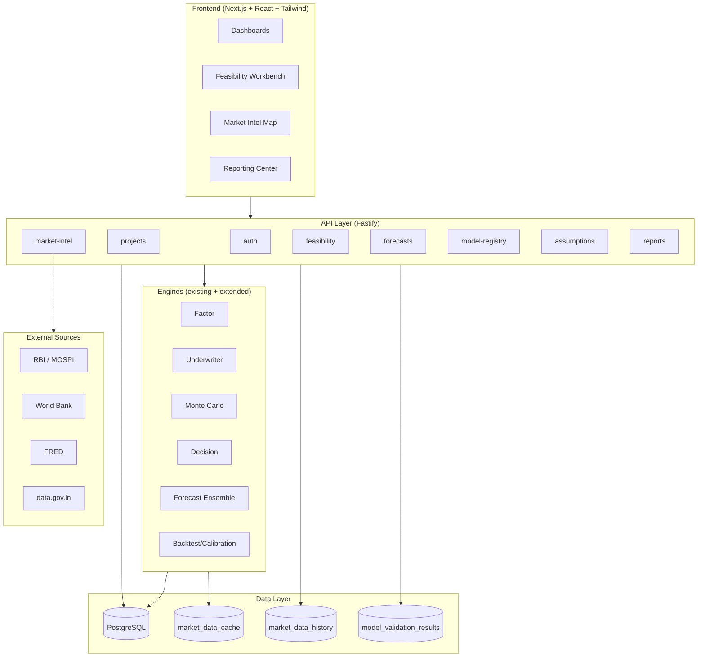

# Investor Advisory Intelligence Platform (IAIP) — Implementation Spec

Production-ready design extending the **V3 Grand** foundation (deals, engines, Market Intelligence, Factor/Underwriter/MC, Agent). Implementation-ready artifacts for Cursor + modern web stack.

---

## 1. Assumptions & Constraints

| # | Assumption | Constraint |
|---|------------|------------|
| A1 | **Foundation** | Build on existing `deals`, `engine_results`, `recommendations`, `market_data_cache`, `market_data_history`, `risks`, `model_validation_results`. No big-bang rewrite. |
| A2 | **Monolith-first** | Prefer single API (Fastify) + single DB (PostgreSQL) until scale demands; microservices (market-intel, gis, feasibility, etc.) are logical modules, not mandatory separate processes at MVP. |
| A3 | **India + INR** | Primary currency INR; USD reporting optional. Tax/fees: GST, stamp duty, local levies as configurable placeholders. |
| A4 | **Property types** | Hotel (airport/business/leisure/resort), mixed-use, retail, office, industrial, data center. Schema and engines support `asset_class` and property-type-specific fields. |
| A5 | **5 features** | DQ/NL (A), BTC (B), Triangulation (C), SSM (D), AGAT (E) are first-class: schema, APIs, and UI support them from day one. |
| A6 | **Python optional** | Heavy modeling (backtest, Monte Carlo, ensemble) can stay in Node/TypeScript (existing engines) or move to a Python/FastAPI service when needed; spec defines contracts so either can implement. |
| A7 | **Auth** | Existing demo auth (session + roles) suffices for MVP; OAuth + org/team/project RBAC is V1. |
| A8 | **GIS** | Mapbox or Google Maps; corridor/scoring can be API-driven (lat/lng + buffers) without full GIS server at MVP. |
| A9 | **IC memo** | Template-driven PDF/Doc export; full audit trail from existing `audit_log` + new `assumption_governance` and `report_generations`. |

---

## 2. Platform Architecture



**ASCII variant:**

```
[React UI] --> [Fastify API] --> [Engines: Factor|Underwriter|MC|Decision|Ensemble|Backtest]
                    |                    |
                    v                    v
              [PostgreSQL]  [market_data_cache / history / model_validation_results]
                    ^
                    |
              [RBI|WB|FRED|data.gov.in]
```

---

## 3. Service Breakdown (Responsibilities + Data Ownership)

| Service / Module | Responsibility | Data ownership | Notes |
|------------------|----------------|----------------|-------|
| **api-gateway** | Auth, routing, rate limit | — | Current Fastify app; add routes per module. |
| **market-intel** | Demand drivers, supply/competition, Demand Index, Saturation, Price Power, Confidence | `market_data_cache`, `market_data_history`, `market_metrics` (new) | Extends existing MCP service. |
| **gis-service** | Proximity scoring, corridor, POI, heatmaps | `location_scores`, `corridor_definitions` (new) | Can be in-process or separate. |
| **feasibility-service** | IRR/NPV/DSCR/breakeven, scenarios, Monte Carlo (SSM) | `deals`, `engine_results`, `scenario_runs` (new) | Uses existing underwriter + MC. |
| **forecast-ensemble-service** | Triangulation (3-way forecast), calibration | `forecast_models`, `forecast_runs` (new) | FEATURE C + B. |
| **model-registry-service** | Model versions, backtest metrics, retrain triggers | `model_validation_results`, `forecast_models` | FEATURE B. |
| **data-ingestion-service** | Ingest, normalize, dedupe, lineage (DQ/NL) | `data_lineage`, `market_metrics` | FEATURE A. |
| **assumption-governance** | Draft → Reviewed → Approved → Locked, audit | `assumptions` (new), `audit_log` | FEATURE E. |
| **revenue-anchor-service** | Revenue mix, margin per anchor, phased rollout | Deal JSONB + `revenue_anchors` (new) | New module. |
| **hospitality-service** | Occupancy/ADR/RevPAR by segment, banquet, operator/franchise | Extends underwriter + new endpoints | New module. |
| **tenant-mix-service** | Tenant demand, rent/sqft, fit score, pre-lease prob | `tenant_recommendations` (new) | New module. |
| **capital-markets-service** | Deal structures, investor matching, comps | `deal_structures`, `investor_profiles`, `comps` (new) | New module. |
| **risk-service** | Risk register, mitigations, gating | `risks` (existing), `risk_scores` (new) | Extends existing. |
| **reporting-service** | IC memo generation, export, version history | `reports`, `audit_log` | FEATURE E. |

---

## 4. Database Schema (Tables + Key Fields + Indexes)

**Existing (keep):** `users`, `deal_access`, `deals`, `engine_results`, `recommendations`, `audit_log`, `budget_lines`, `change_orders`, `rfis`, `milestones`, `domain_events`, `market_data_cache`, `market_data_history`, `pending_actions`, `model_validation_results`, `risks`.

**New / extended tables:**

```sql
-- FEATURE A: Data lineage + normalized metrics
CREATE TABLE market_metrics (
  id UUID PRIMARY KEY DEFAULT gen_random_uuid(),
  deal_id UUID REFERENCES deals(id),
  location_id VARCHAR(100),           -- city/corridor/submarket
  metric_key VARCHAR(100) NOT NULL,   -- e.g. occupancy, adr, revpar, rent_psf
  value DECIMAL(18,6) NOT NULL,
  unit VARCHAR(20),
  as_of_date DATE NOT NULL,
  source VARCHAR(100) NOT NULL,
  source_type VARCHAR(20) NOT NULL,  -- live-api | official | fallback
  confidence DECIMAL(3,2) CHECK (confidence >= 0 AND confidence <= 1),
  lineage_id UUID,                    -- links to data_lineage
  created_at TIMESTAMPTZ NOT NULL DEFAULT now()
);
CREATE INDEX idx_mm_deal_location ON market_metrics(deal_id, location_id);
CREATE INDEX idx_mm_key_as_of ON market_metrics(metric_key, as_of_date);

CREATE TABLE data_lineage (
  id UUID PRIMARY KEY DEFAULT gen_random_uuid(),
  entity_type VARCHAR(50) NOT NULL,   -- property | developer | tenant | metric
  entity_id VARCHAR(255) NOT NULL,
  source_system VARCHAR(100) NOT NULL,
  source_id VARCHAR(255),
  transformation VARCHAR(255),
  created_at TIMESTAMPTZ NOT NULL DEFAULT now()
);
CREATE INDEX idx_dl_entity ON data_lineage(entity_type, entity_id);

-- FEATURE B: Forecast models + runs (backtesting)
CREATE TABLE forecast_models (
  id UUID PRIMARY KEY DEFAULT gen_random_uuid(),
  name VARCHAR(100) NOT NULL,
  version VARCHAR(50) NOT NULL,
  model_type VARCHAR(50) NOT NULL,    -- comparables | demand_driver | timeseries | ensemble
  target_metric VARCHAR(50) NOT NULL, -- occupancy | adr | revpar | rent_psf
  config JSONB NOT NULL,
  created_at TIMESTAMPTZ NOT NULL DEFAULT now(),
  UNIQUE(name, version)
);
CREATE INDEX idx_fm_target ON forecast_models(target_metric);

CREATE TABLE forecast_runs (
  id UUID PRIMARY KEY DEFAULT gen_random_uuid(),
  deal_id UUID NOT NULL REFERENCES deals(id),
  model_id UUID NOT NULL REFERENCES forecast_models(id),
  scenario_key VARCHAR(20) NOT NULL DEFAULT 'base',
  input_snapshot JSONB NOT NULL,
  output JSONB NOT NULL,              -- predictions, weights, components
  metrics JSONB,                     -- mape, rmse, calibration_score
  created_at TIMESTAMPTZ NOT NULL DEFAULT now()
);
CREATE INDEX idx_fr_deal ON forecast_runs(deal_id);
CREATE INDEX idx_fr_model ON forecast_runs(model_id);

-- FEATURE E: Assumption governance (AGAT)
CREATE TABLE assumptions (
  id UUID PRIMARY KEY DEFAULT gen_random_uuid(),
  deal_id UUID NOT NULL REFERENCES deals(id),
  assumption_key VARCHAR(100) NOT NULL,  -- e.g. occupancy_year_1, adr_growth
  value JSONB NOT NULL,
  unit VARCHAR(20),
  owner VARCHAR(255) NOT NULL,
  rationale VARCHAR(2000),
  source VARCHAR(255),
  confidence DECIMAL(3,2) CHECK (confidence >= 0 AND confidence <= 1),
  last_reviewed_at TIMESTAMPTZ,
  status VARCHAR(20) NOT NULL DEFAULT 'draft',  -- draft | reviewed | approved | locked
  approved_by VARCHAR(255),
  approved_at TIMESTAMPTZ,
  created_at TIMESTAMPTZ NOT NULL DEFAULT now(),
  updated_at TIMESTAMPTZ NOT NULL DEFAULT now(),
  UNIQUE(deal_id, assumption_key)
);
CREATE INDEX idx_assump_deal_status ON assumptions(deal_id, status);

-- Scenarios (extend deal.scenarios or materialize)
CREATE TABLE scenario_runs (
  id UUID PRIMARY KEY DEFAULT gen_random_uuid(),
  deal_id UUID NOT NULL REFERENCES deals(id),
  scenario_key VARCHAR(20) NOT NULL,
  label VARCHAR(100),
  inputs_snapshot JSONB NOT NULL,
  outputs JSONB NOT NULL,             -- irr, npv, dscr, etc.
  monte_carlo_run_id UUID,
  created_at TIMESTAMPTZ NOT NULL DEFAULT now()
);
CREATE INDEX idx_sr_deal ON scenario_runs(deal_id);

CREATE TABLE monte_carlo_runs (
  id UUID PRIMARY KEY DEFAULT gen_random_uuid(),
  deal_id UUID NOT NULL REFERENCES deals(id),
  scenario_key VARCHAR(20) NOT NULL DEFAULT 'base',
  iterations INT NOT NULL,
  seed INT,
  outputs JSONB NOT NULL,             -- percentiles, P(IRR>target), P(DSCR>1.2)
  created_at TIMESTAMPTZ NOT NULL DEFAULT now()
);
CREATE INDEX idx_mcr_deal ON monte_carlo_runs(deal_id);

-- Revenue anchors (hotel + mixed-use)
CREATE TABLE revenue_anchors (
  id UUID PRIMARY KEY DEFAULT gen_random_uuid(),
  deal_id UUID NOT NULL REFERENCES deals(id),
  anchor_type VARCHAR(50) NOT NULL,   -- rooms | restaurant | banquet | spa | retail | office
  name VARCHAR(255),
  capex DECIMAL(18,2) NOT NULL DEFAULT 0,
  opex_annual DECIMAL(18,2) NOT NULL DEFAULT 0,
  revenue_lines JSONB NOT NULL,       -- [{ label, amount, margin }]
  phase INT DEFAULT 1,
  created_at TIMESTAMPTZ NOT NULL DEFAULT now()
);
CREATE INDEX idx_ra_deal ON revenue_anchors(deal_id);

-- Reports (IC memo + exports)
CREATE TABLE reports (
  id UUID PRIMARY KEY DEFAULT gen_random_uuid(),
  deal_id UUID NOT NULL REFERENCES deals(id),
  report_type VARCHAR(50) NOT NULL,  -- ic_memo | feasibility_summary
  version INT NOT NULL DEFAULT 1,
  file_path VARCHAR(500),             -- GCS/S3 key if stored
  generated_by VARCHAR(255) NOT NULL,
  generated_at TIMESTAMPTZ NOT NULL DEFAULT now(),
  assumption_snapshot JSONB,
  scenario_key VARCHAR(20)
);
CREATE INDEX idx_rep_deal ON reports(deal_id);
```

---

## 5. API Contracts (Key Endpoints + Example Payloads)

**Base:** `GET/POST /projects` → map to existing `deals` or add `projects` table that wraps deal.

- **Create/update project (deal)**  
  `POST /deals` (existing)  
  Body: `{ name, assetClass, property: { location: { city, state, country } }, captureContext, ... }`

- **Run market intel**  
  `POST /deals/:id/market-intel/run`  
  Response: `{ demandIndex, saturationScore, pricePowerScore, confidenceScore, drivers, competitors }`

- **Run feasibility (with scenarios + MC)**  
  `POST /deals/:id/feasibility/run`  
  Body: `{ scenarioKey?: 'base'|'downside'|'upside', runMonteCarlo?: boolean, iterations?: 5000 }`  
  Response: `{ irr, npv, dscr, paybackYear, scenarioOutputs, monteCarlo?: { p10, p50, p90, pIrrAboveTarget, pDscrAboveThreshold } }`

- **Run forecast ensemble (triangulation)**  
  `POST /deals/:id/forecasts/run`  
  Body: `{ targetMetric: 'occupancy'|'adr'|'revpar', asOfYear?: number }`  
  Response: `{ value, components: [{ method: 'comparables'|'demand_driver'|'timeseries', value, weight }], confidence }`

- **Backtest / calibration**  
  `POST /models/backtest/run`  
  Body: `{ modelId, testDealIds: string[], metricKey: 'irr'|'npv'|'occupancy' }`  
  Response: `{ mape, rmse, calibrationScore, passed }`

- **Assumption approve (AGAT)**  
  `PATCH /deals/:id/assumptions/:key`  
  Body: `{ value, rationale?, status: 'reviewed'|'approved'|'locked' }`  
  `POST /deals/:id/assumptions/:key/approve`  
  Body: `{ approvedBy, note }`

- **Generate IC memo**  
  `POST /reports/ic-memo/generate`  
  Body: `{ dealId, scenarioKey?: 'base', includeAuditTrail: true }`  
  Response: `{ reportId, fileUrl?, generatedAt }`

**Example: feasibility run response**

```json
{
  "scenarioKey": "base",
  "irr": 0.182,
  "npv": 125000000,
  "dscr": 1.42,
  "paybackYear": 5.2,
  "equityMultiple": 2.1,
  "scenarioOutputs": {
    "base": { "irr": 0.182, "npv": 125000000 },
    "downside": { "irr": 0.12, "npv": 45000000 },
    "upside": { "irr": 0.22, "npv": 198000000 }
  },
  "monteCarlo": {
    "iterations": 5000,
    "p10Irr": 0.14, "p50Irr": 0.18, "p90Irr": 0.23,
    "pIrrAboveTarget": 0.72,
    "pDscrAboveThreshold": 0.89
  }
}
```

---

## 6. UI Structure (Screens + Widgets)

| Screen | Key widgets |
|--------|-------------|
| **Investment Opportunity Dashboard** | Summary KPIs (IRR/NPV/DSCR, risk score, confidence); scenario toggles Base/Downside/Upside; Monte Carlo probability cards (P(IRR>target), P(DSCR>1.2)); trend sparklines. |
| **Market Intelligence Map** | Map (Mapbox/Google); layers: corridor score, competitors, infra; filters: property type, segment, period; legend + tooltips. |
| **Feasibility Workbench** | Editable assumptions table (key, value, unit, owner, rationale, source, confidence, status); workflow actions (Submit for review, Approve, Lock); tornado chart (top 10 drivers); cashflow waterfall; debt schedule. |
| **Revenue Anchor Simulator** | Anchor list with sliders (capex, opex, revenue mix); profitability per anchor; phased rollout timeline; risk score per anchor. |
| **Hospitality Dashboard** | Occupancy/ADR/RevPAR by segment (corporate, leisure, groups, events); banquet/event revenue block; operator vs franchise fee comparison table. |
| **Tenant Mix Planner** | Tenant recommendations (name, category, rent/sqft, fit score); pre-lease probability; leasing timeline Gantt. |
| **Risk Console** | Risk register table (category, likelihood, impact, status, mitigation); gating checklist; risk score gauge. |
| **Reporting Center** | “Generate IC memo” button; export PDF/Doc; version history list; audit trail viewer (what changed, when, by whom). |

---

## 7. Algorithms (A–E)

### FEATURE A — Confidence propagation (data → forecast → feasibility)

```text
confidence_output = min(confidence_input_1, ..., confidence_input_n) * model_confidence
# Per-datapoint: 0–1 from source (live=1, official=0.9, fallback=0.7).
# Model confidence from backtest calibration (e.g. 0.85).
# Store on market_metrics.confidence and in forecast_runs.outputs.confidence.
```

### FEATURE B — Backtesting loop

```python
def backtest(model_id, test_deal_ids, metric_key='irr'):
    predictions, actuals = [], []
    for deal_id in test_deal_ids:
        pred = run_forecast(deal_id, model_id)
        actual = get_realized_metric(deal_id, metric_key)  # from engine_results/history
        predictions.append(pred); actuals.append(actual)
    mape = np.mean(np.abs((np.array(actuals) - np.array(predictions)) / (np.array(actuals) + 1e-8))) * 100
    rmse = np.sqrt(np.mean((np.array(actuals) - np.array(predictions))**2))
    calibration = 1 - mape / 100  # 0-1
    return { 'mape': mape, 'rmse': rmse, 'calibrationScore': calibration, 'passed': mape < 20 }
```

### FEATURE C — Triangulation ensemble

```python
def triangulate_forecast(deal_id, target_metric='occupancy', year=5):
    v1 = comparables_benchmark(deal_id, target_metric, year)   # method 1
    v2 = demand_driver_model(deal_id, target_metric, year)     # method 2
    v3 = timeseries_model(deal_id, target_metric, year)        # method 3
    w1, w2, w3 = 0.35, 0.40, 0.25  # configurable; explainable in UI
    value = w1*v1 + w2*v2 + w3*v3
    confidence = weighted_confidence([v1,v2,v3], [w1,w2,w3])
    return { 'value': value, 'components': [
        {'method': 'comparables', 'value': v1, 'weight': w1},
        {'method': 'demand_driver', 'value': v2, 'weight': w2},
        {'method': 'timeseries', 'value': v3, 'weight': w3}
    ], 'confidence': confidence }
```

### FEATURE D — Monte Carlo (IRR/NPV)

```python
def monte_carlo_irr_npv(deal, iterations=5000, seed=None):
    np.random.seed(seed)
    irrs, npvs = [], []
    for _ in range(iterations):
        perturbed = perturb_assumptions(deal, std_occupancy=0.03, std_adr=0.05, ...)
        out = run_underwriter(perturbed)
        irrs.append(out['irr']); npvs.append(out['npv'])
    target_irr = deal['financialAssumptions'].get('targetIRR', 0.15)
    p_irr_above = np.mean(np.array(irrs) >= target_irr)
    p_dscr_above = ...  # from distribution of DSCR
    return { 'p10Irr': np.percentile(irrs,10), 'p50Irr': np.percentile(irrs,50), 'p90Irr': np.percentile(irrs,90),
             'pIrrAboveTarget': p_irr_above, 'pDscrAboveThreshold': p_dscr_above, 'histogram': ... }
```

### FEATURE E — Assumption workflow state machine

```text
States: draft → reviewed → approved → locked
Transitions:
  draft → reviewed   (submit for review)
  reviewed → draft   (return for edits)
  reviewed → approved (approver action)
  approved → locked  (lock for IC)
  locked — no further edits; new version creates new assumption row or clone.
On each transition: write audit_log(dealId, userId, action, entityType='assumption', entityId, diff).
```

### Sample feasibility (India airport hotel)

**Assumptions (base):**  
Land cost 45 Cr, Construction 120 Cr, FF&E 18 Cr, Opening Q4 2027. Rooms 200, ADR growth 4% p.a., occupancy ramp 65% Y1 → 72% Y5. Debt 60% LTV, 10.5% interest, 18 years. Opex 38% of revenue.

**Base case:** IRR 18.2%, NPV 12.5 Cr, DSCR 1.42, Payback 5.2 years.

**Downside:** Occupancy -5 pp, ADR -8% → IRR 12.0%, NPV 4.5 Cr.

**Monte Carlo (5k runs):** P(IRR>15%)=72%, P(DSCR>1.2)=89%, P50 IRR 18%.

---

## 8. Repo Scaffolding Plan

**Current layout (keep):**

- `packages/api` — Fastify routes, agent, market, deals, dashboard
- `packages/db` — Drizzle schema, migrations, queries
- `packages/engines` — underwriter, factor, montecarlo, decision, budget, scurve
- `packages/mcp` — market data service (RBI, FRED, World Bank, data.gov.in)
- `packages/ui` — Next.js, deals, agent, portfolio, dashboard

**Add:**

```
packages/
  api/src/routes/
    market-intel.ts    (extend: run analysis, demand index, saturation)
    feasibility.ts     (scenarios, MC trigger, scenario_runs)
    forecasts.ts      (ensemble run, forecast_runs)
    models.ts         (backtest run, model_versions)
    assumptions.ts    (CRUD + approve, lock)
    reports.ts        (IC memo generate)
  db/src/migrations/
    008_iaip_market_metrics_lineage.sql
    009_iaip_forecast_models_runs.sql
    010_iaip_assumptions_governance.sql
    011_iaip_scenario_mc_reports.sql
    012_iaip_revenue_anchors.sql
  engines/src/
    ensemble/         (triangulation)
    backtest/        (backtest runner)
  ui/src/app/
    deals/[id]/feasibility/   (workbench)
    deals/[id]/reports/      (reporting center)
  ui/src/components/
    feasibility/     (assumptions table, tornado, waterfall)
    reports/         (IC memo preview, export)
```

**Next steps (order):**

1. Run migrations 008–012 (add tables).
2. Implement `assumptions` API + FEATURE E state machine; wire to deal financial/market assumptions.
3. Add `POST /deals/:id/feasibility/run` (scenarios + optional MC) and `POST /deals/:id/forecasts/run` (ensemble stub).
4. Add `POST /models/backtest/run` using `model_validation_results`.
5. Build Feasibility Workbench UI (assumptions table, scenario toggles, tornado).
6. Add IC memo template and `POST /reports/ic-memo/generate` (HTML → PDF or Doc).

---

## 9. Development Roadmap

| Phase | Scope | Priorities |
|-------|--------|------------|
| **MVP (current + 4–6 weeks)** | Foundation + FEATURE E + SSM basics | Assumptions table + governance (draft/reviewed/approved/locked); scenario toggles Base/Downside/Upside; Monte Carlo on existing engine; one-page Feasibility Workbench; audit trail for assumption changes. |
| **V1 (8–12 weeks)** | Full 5 features + reporting | DQ/NL: lineage on market_metrics; BTC: forecast_models + forecast_runs + backtest API; Triangulation: ensemble service + UI; AGAT: full workflow in UI; IC memo generation + export. |
| **V2 (12+ weeks)** | Modules + India/Hotel depth | Location Intelligence (GIS, corridor scoring); Revenue Anchor Optimizer; Hospitality module (segment mix, banquet); Tenant Mix Planner; Capital Markets (comps, structures); Risk Console enhancements; multi-org RBAC. |

---

*This spec is implementation-ready: schema and APIs align with the existing V3 Grand codebase and the five institutional-grade features (DQ/NL, BTC, Triangulation, SSM, AGAT).*
